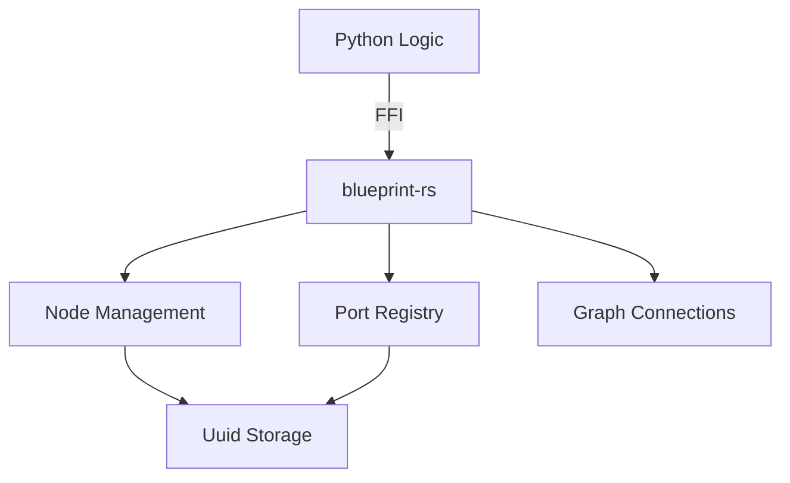

# blueprint-rs — Visual Scripting Framework 

A high-performance, graph-based logic engine written in Rust and exposed to Python via PyO3. Designed to be the core backend for standalone visual scripting platforms.

---

## Overview

`blueprint-rs` provides a robust, thread-safe, and high-performance foundation for building visual scripts. It handles the underlying graph theoretical math, unique object identification via UUIDs, and relationship mapping between logical units (Nodes) and their entry/exit points (Ports).

### Core Features

- **Rust High-Performance Performance** — Native speed for complex graph manipulations and execution.
- **Python-Native Integration** — Seamless usage from Python with zero-cost abstractions for shared memory.
- **Uuid Identification** — Every Node and Port carries unique V4 UUID for persistent tracking.
- **Typed Logic Flow** — Supports various data types including Execution signals, Integers, Booleans, and Strings.

---

## Documentation Registry

For detailed, file-specific documentation and internal architecture, please refer to the files in the `docs/` directory:

| Component | Purpose | Documentation Link |
|---|---|---|
| **API Entry Point** | Module registration | [`docs/lib.md`](file:///c:/Users/Azzo/Documents/My%20Projects/blueprint-rs/docs/lib.md) |
| **Logic Nodes** | Core state & lifecycle | [`docs/node.md`](file:///c:/Users/Azzo/Documents/My%20Projects/blueprint-rs/docs/node.md) |
| **Input/Output Ports** | Signal definition | [`docs/port.md`](file:///c:/Users/Azzo/Documents/My%20Projects/blueprint-rs/docs/port.md) |
| **Graph Connections** | Relationship mapping | [`docs/connection.md`](file:///c:/Users/Azzo/Documents/My%20Projects/blueprint-rs/docs/connection.md) |
| **Type Storage** | Data & Arithmetic | [`docs/datatype.md`](file:///c:/Users/Azzo/Documents/My%20Projects/blueprint-rs/docs/datatype.md) |

---

## Requirements

### Developer Tooling
- **Rust Compiler**: (stable branch).
- **Python 3.10+**: For orchestrating the high-level graph logic.
- **Maturin**: Required to compile and build the Python module.

---

## Build & Installation

To build and install the engine into your current python environment for local development:

```bash
# Activation of .venv is recommended
maturin develop
```

### Simple Integration Example

```python
import blueprint_rs
from blueprint_rs import Node, DataType

# Create a processing node
node = Node("Process_Data", (10.0, 50.0))

print(f"Node '{node.name}' identified by: {node.id}")
```

---

## Examples

You can find complete demonstration scripts in the [**`examples/`**](file:///c:/Users/Azzo/Documents/My%20Projects/blueprint-rs/examples) directory:

- [**`examples/arithmetic.py`**](file:///c:/Users/Azzo/Documents/My%20Projects/blueprint-rs/examples/arithmetic.py) — Demonstrates basic and mixed-type math logic within the node engine.

---

## Architecture Diagram


