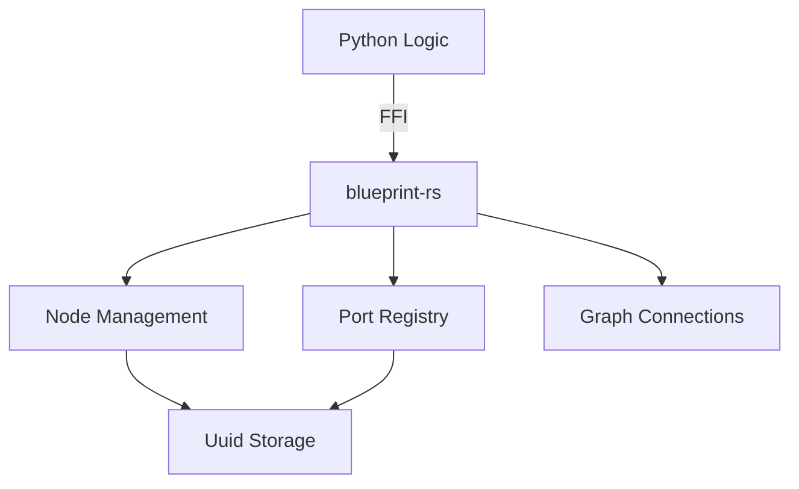

<<<<<<< HEAD
# blueprint-rs — Independent Visual Scripting Engine

A high-performance, graph-based logic engine written in Rust and exposed to Python via PyO3. Designed to be the core backend for stand-alone visual scripting platforms.
=======
# Iris.browser — Browser Automation

> A high-level browser automation module for the Iris framework.  
> Powered by **DrissionPage** for reliable and fast headless/headed browser control.
>>>>>>> 00dc537a45fe53b30d1360d6682d059d30a3cd5c

---

## Overview

<<<<<<< HEAD
`blueprint-rs` provides a robust, thread-safe, and high-performance foundation for building visual scripts. It handles the underlying graph theoretical math, unique object identification via UUIDs, and relationship mapping between logical units (Nodes) and their entry/exit points (Ports).

### Core Features

- **Rust High-Performance Performance** — Native speed for complex graph manipulations and execution.
- **Python-Native Integration** — Seamless usage from Python with zero-cost abstractions for shared memory.
- **Uuid Identification** — Every Node and Port carries unique V4 UUID for persistent tracking.
- **Typed Logic Flow** — Supports various data types including Execution signals, Integers, Booleans, and Strings.

---

## Documentation Registry

For detailed, file-specific documentation and internal architecture, please refer to the files in the `docs/` directory:

| Component | Purpose | Documentation Link |
|---|---|---|
| **API Entry Point** | Module registration | [`docs/lib.md`](file:///c:/Users/Azzo/Documents/My%20Projects/blueprint-rs/docs/lib.md) |
| **Logic Nodes** | Core state & lifecycle | [`docs/node.md`](file:///c:/Users/Azzo/Documents/My%20Projects/blueprint-rs/docs/node.md) |
| **Input/Output Ports** | Signal definition | [`docs/port.md`](file:///c:/Users/Azzo/Documents/My%20Projects/blueprint-rs/docs/port.md) |
| **Graph Connections** | Relationship mapping | [`docs/connection.md`](file:///c:/Users/Azzo/Documents/My%20Projects/blueprint-rs/docs/connection.md) |
| **Logic Type System** | Shared type registry | [`docs/datatype.md`](file:///c:/Users/Azzo/Documents/My%20Projects/blueprint-rs/docs/datatype.md) |

---

## Requirements

### Developer Tooling
- **Rust Compiler**: (stable branch).
- **Python 3.10+**: For orchestrating the high-level graph logic.
- **Maturin**: Required to compile and build the Python module.

---

## Build & Installation

To build and install the engine into your current python environment for local development:

```bash
# Activation of .venv is recommended
maturin develop
```

### Simple Integration Example

```python
import blueprint_rs
from blueprint_rs import Node, DataType

# Create a processing node
node = Node("Process_Data", (10.0, 50.0))

print(f"Node '{node.name}' identified by: {node.id}")
=======
Iris.browser provides a simplified interface to control web browsers (Chromium-based like Chrome, Edge, and Ungoogled Chromium). It integrates seamlessly with the **Zapper** MITM proxy for traffic interception and modification.

Instead of traditional Selenium or Playwright, it uses [DrissionPage](https://github.com/g1879/DrissionPage), which combines the power of raw CDP (Chrome DevTools Protocol) with the ease of `requests`.

---

## Core Logic Engine: `blueprint-rs`

The underlying node-based logic engine for Iris is powered by a high-performance Rust core: **`blueprint-rs`**.

### Documentation

For detailed information on the Rust internal logic and classes, refer to the following documentation files in the `docs/` folder:

- [Python API Entry Point (`lib.rs`)](file:///c:/Users/Azzo/Documents/My%20Projects/blueprint-rs/docs/lib.md)
- [Node Implementation (`node.rs`)](file:///c:/Users/Azzo/Documents/My%20Projects/blueprint-rs/docs/node.md)
- [Port Identification (`port.rs`)](file:///c:/Users/Azzo/Documents/My%20Projects/blueprint-rs/docs/port.md)
- [Relationship Mapping (`connection.rs`)](file:///c:/Users/Azzo/Documents/My%20Projects/blueprint-rs/docs/connection.md)
- [Type System (`datatype.rs`)](file:///c:/Users/Azzo/Documents/My%20Projects/blueprint-rs/docs/datatype.md)

---

## Requirements & Prerequisites

### Systems
- **OS**: Windows, macOS, or Linux.
- **Browser**: Chrome, Edge, or Any Chromium-based browser.

### Build Tools & Libraries
- **Rust Toolchain**: To compile the `blueprint-rs` core.
- **Python 3.10+**: Main environment for Iris orchestration.
- **DrissionPage**: Required for browser control.
- **Maturin**: Recommended for building and installing the Rust extension.

---

## Installation

### 1. Building the Rust Core
Navigate to the root of `blueprint-rs` and build the Python extension:
```bash
maturin develop
```

### 2. Python Dependencies
Ensure your virtual environment is active:
```bash
# Windows
.venv\Scripts\activate

# Linux / Mac
source .venv/bin/activate

pip install drissionpage
>>>>>>> 00dc537a45fe53b30d1360d6682d059d30a3cd5c
```

---

<<<<<<< HEAD
## Architecture Diagram


=======
## Architecture

```
┌──────────────────────────────────────────────────────────┐
│                      Iris.browser                        │
│                                                          │
│   Browser (browser.py)        Proxy (proxy.py)           │
│   ├── start()                 ├── host                   │
│   ├── stop()                  ├── port                   │
│   └── page (ChromiumPage)     └── protocol               │
│               │                                          │
│               │                                          │
└───────────────┼──────────────────────────────────────────┘
                │
┌───────────────▼──────────────────────────────────────────┐
│                    DrissionPage                          │
│                                                          │
│   ChromiumPage                ChromiumOptions            │
│               │                                          │
└───────────────┼──────────────────────────────────────────┘
                │
┌───────────────▼──────────────────────────────────────────┐
│                    Chromium Browser                      │
│                                                          │
│   Chrome / Edge / Ungoogled Chromium                     │
│                                                          │
└──────────────────────────────────────────────────────────┘
```

---

## Usage Examples

### Simple Navigation

```python
from Iris.browser import Browser

with Browser() as browser:
    page = browser.page
    page.get("https://httpbin.org/get")
    print(page.html)
```

### Integrated with Zapper Proxy

```python
from Iris.core.zapper import Zapper
from Iris.browser import Browser, Proxy

# 1. Start Zapper
with Zapper(port=8080) as zapper:
    print(f"Zapper listening on {zapper.proxy_url}")
    
    # 2. Configure Browser
    proxy_config = Proxy(host="127.0.0.1", port=8080)
    
    # 3. Start Browser
    with Browser(proxy=proxy_config) as browser:
        browser.page.get("https://example.com")
```

---

## Further Reading

- [DrissionPage Documentation](https://drissionpage.cn/en/) (Comprehensive API reference).
- [Zapper Documentation](zapper.md) (Detailed MITM proxy engine info).
>>>>>>> 00dc537a45fe53b30d1360d6682d059d30a3cd5c
